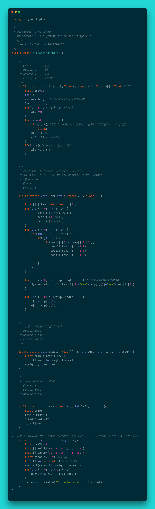

第二题：

- **问题**：给定n种物品和一个背包。物品i的重量是Wi，其价值为Vi，背包的容量为C。应如何选择装入背包的物品，可以选择物品i的一部分,使得装入背包中物品的总价值最大?

- **思想：**贪心算法，将问题每次分解成子问题，并在一次次解决子问题后，使得问题最终得到解决。在解决子问题时总是选择局部最优解，而且不考虑后果，从而达到全局最优解。并不是每一种问题都适合采用这种策略的，例如：

  

  现在，要求这棵二叉树的权值最大值，如何选？

  - **正确答案**：11+3+65=**79**

  - **贪心策略答案**：11+8+22=**41**

    应用贪心策略，这里选择的是局部最优解，第二层选大的是8，接着第三层选大的是22，然而，并不是全局最优解！

- **分析：** 贪心算法的问题中，背包问题是一种很经典的可以利用贪心求解的问题，那么理解一下题目的意思后，可以开始写，这里同样也有更形象易于思考的方法：

  - 在草稿纸画出来，假设一个重量数组，价值数组，权值重量比数组，选择的货物比例x数组，然后写出用贪心求解的每一步，具体如下：

    

    如上，假设出初始化的货物数据，背包的 capacity 为15kg，以及选择的 step，第一次选 货物5，第二次选 货物1，第三次选 货物6...... 最后选的就是 货物2，然而 货物2的重量为 3kg，这里不是 01背包 问题，可以选部分的，所以，选择的 3kg 中的 2kg 部分，那么对应的x数组中的选择就为 2/3！背包此时为空了，那么其他的 货物 没选上，对应的x数组的值直接赋为0

  - 接着用贪心策略：就是每一次选取权值重量比最大的再与对应的x的值，也就是选择比例相乘—p[i]*x[i]，再依次相加，即可

  - 具体实现的思路：对p/weight排序！再利用这个权值重比数组与背包容量来进行step操作

  - 背包问题模板：

    

- **注意**：本次在用 Java 实现时还是碰到了许多坑，**Sort() 方法要如何实现，到底如何对w、v、v/w同时排序？**因为这三个数组是一一对应的关系的，基于 Java 想到了三种解决方案，不过由于题目与引用传递限制，还是只能用一种：

  - **用HashMap映射**，有了<key, value>存储方式后，就可以用<v/w, <v, w>>这样一种方式排序了

  - **用货物类Product**，封装三个数据成有三个私有的字段value, weight, value/weight，然后用这种数组实例化一个数组后，可以相应排序

  - **用二维数组存三种数据**，二维数组是n行3列的，每一行代表一个货物，一行的三列可分别对应value, weight, value/weight，所以每次排序交换时，最后还是选择用这种方案实现了，如下：

    

- **题目答案**：综上终于可以写出题目答案了

  